# CNN Parallelism Performance Analysis

Comprehensive performance analysis and visualization of serial vs parallel CNN inference implementations on MNIST dataset.

## System Configuration

- **CPU**: Apple M2
- **Cores**: 8
- **RAM**: 16 GB
- **OS**: Darwin arm64
- **Dataset**: MNIST (10,000 test images)
- **Model**: CNN with Conv1(16×14×14) → Conv2(32×7×7) → FC1(200) → FC2(200) → Output(10)
- **Accuracy**: 97.32% (consistent across all implementations)

## Benchmark Overview

Three parallelization strategies were evaluated:

1. **Serial Baseline**: Single-threaded CPU execution
2. **Data Parallel (MPI)**: Dataset partitioned across multiple processes (1-8 processes)
3. **Pipeline Parallel (MPI)**: Network layers distributed across 5 processes

## Performance Metrics Summary

| Implementation | Processes | Time(s) | Throughput (img/s) | Speedup | Efficiency | Memory (MB) |
|----------------|-----------|---------|-------------------|---------|------------|-------------|
| Serial | 1 | 5.276 | 1,895.4 | 1.00x | 100.0% | 11.8 |
| Data Parallel | 2 | 2.767 | 3,614.0 | 1.91x | 95.3% | 22.4 |
| Data Parallel | 3 | 1.912 | 5,230.2 | 2.76x | 92.0% | 22.6 |
| Data Parallel | 4 | 1.440 | 6,942.9 | 3.66x | 91.6% | 22.6 |
| Data Parallel | 5 | 1.296 | 7,716.5 | 4.07x | 81.4% | 22.6 |
| Data Parallel | 6 | 1.164 | 8,591.0 | 4.53x | 75.5% | 22.5 |
| Data Parallel | 7 | 1.064 | 9,394.3 | 4.96x | 70.8% | 22.7 |
| Data Parallel | 8 | 0.975 | 10,252.4 | 5.41x | 67.6% | 22.7 |
| Pipeline | 5 | 3.368 | N/A | 1.57x | 31.3% | N/A |

## Detailed Performance Analysis

### 1. Execution Time Analysis

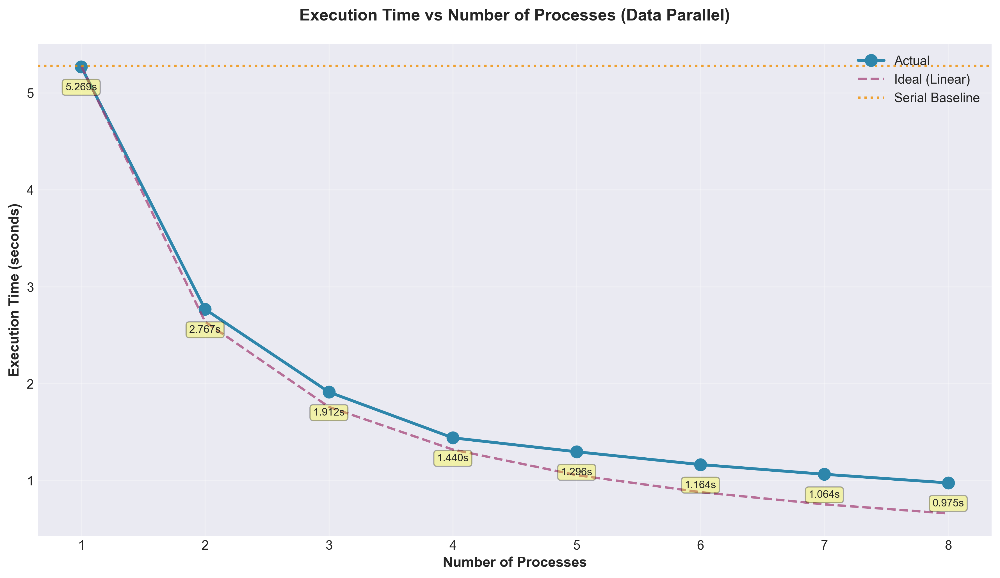

**Key Insights:**
- Serial baseline: 5.276 seconds
- Best data parallel (8P): 0.975 seconds
- **5.41x speedup** achieved with 8 processes
- Execution time decreases consistently but with diminishing returns
- Gap between actual and ideal scaling increases with more processes

**Observations:**
- Near-linear scaling up to 4 processes
- Diminishing returns become evident beyond 5 processes
- Communication and synchronization overhead increases with process count

### 2. Speedup Analysis

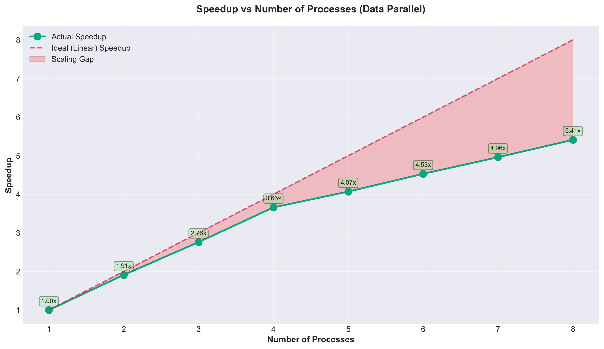

**Key Insights:**
- Linear speedup maintained up to 4 processes (3.66x on 4 cores)
- Speedup curve diverges from ideal after 4 processes
- Maximum achieved: **5.41x on 8 cores** (67.6% of ideal 8x)
- Scaling gap (red area) represents lost efficiency

**Amdahl's Law Implications:**
- The increasing gap suggests serial bottlenecks and communication overhead
- Approximately 32.4% efficiency loss at 8 processes
- Strong scaling characteristics typical of fine-grained parallelism

### 3. Parallel Efficiency Analysis

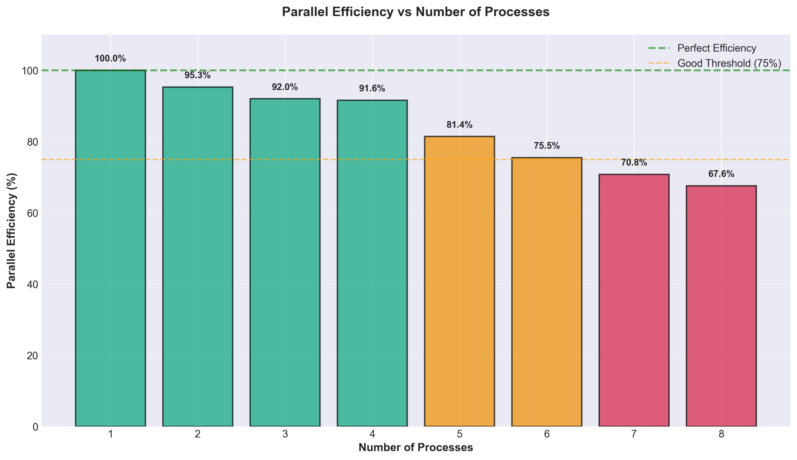

**Key Insights:**
- **Excellent efficiency (>90%)** maintained up to 4 processes
- Efficiency drops to 81.4% at 5 processes (critical inflection point)
- Continues declining: 75.5% (6P) → 70.8% (7P) → 67.6% (8P)
- Threshold analysis:
  - Green (>90%): Processes 1-4
  - Orange (75-90%): Processes 5-6
  - Red (<75%): Processes 7-8

**Recommendations:**
- **Optimal configuration**: 4 processes (91.6% efficiency, 3.66x speedup)
- **Maximum throughput**: 8 processes (67.6% efficiency, 5.41x speedup)
- Trade-off between efficiency and absolute performance

### 4. Throughput Analysis

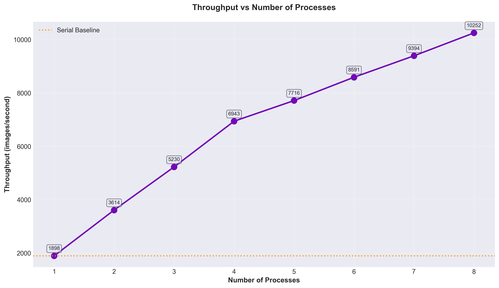

**Key Insights:**
- Serial baseline: 1,898 images/second
- Peak throughput: **10,252 images/second** (8 processes)
- **5.41x improvement** in throughput
- Consistent growth across all process counts

**Throughput Progression:**
- 1P→2P: 1.90x increase (3,614 img/s)
- 2P→3P: 1.45x increase (5,230 img/s)
- 3P→4P: 1.33x increase (6,943 img/s)
- 4P→8P: 1.48x increase (10,252 img/s)

**Application Context:**
- High-throughput batch processing benefits from 8 processes
- Real-time applications may prefer 4 processes (lower latency variance)

### 5. Latency Analysis

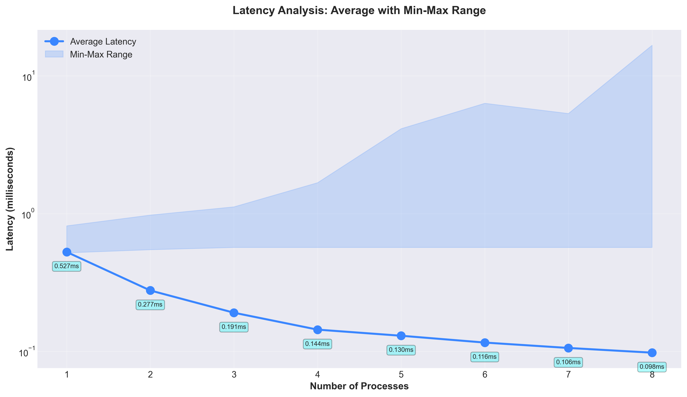

**Key Insights:**
- Average latency decreases from 0.527ms (1P) to 0.098ms (8P)
- **Minimum latency remains stable** at ~0.55ms across configurations
- **Maximum latency increases dramatically** with process count
- Latency variance (max-min range) grows significantly:
  - 1P: 0.296ms variance
  - 4P: 1.109ms variance
  - 8P: 16.103ms variance (54x larger)

**Critical Observations:**
- Average latency improves consistently
- Worst-case latency degrades (important for latency-sensitive applications)
- High variance at 8P suggests scheduling and synchronization issues
- Logarithmic scale reveals exponential growth in maximum latency

**Latency-Critical Recommendations:**
- For predictable latency: Use 2-4 processes
- For lowest average latency: Use 8 processes (accept variance)

### 6. Communication Overhead Analysis

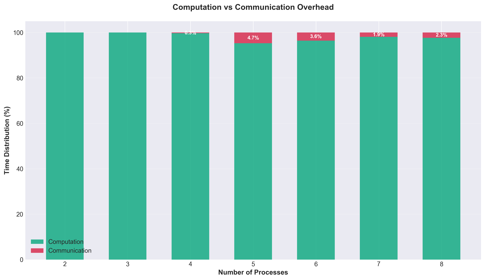

**Key Insights:**
- Minimal communication overhead across all configurations
- 2P-3P: **0.0% overhead** (negligible)
- 4P-8P: **0.3%-4.7% overhead** (excellent)
- Peak overhead: 4.7% at 5 processes
- Remains below 5% threshold across all tested configurations

**Breakdown by Process Count:**
- 2P: 100.0% computation, 0.0% communication
- 3P: 100.0% computation, 0.0% communication
- 4P: 99.7% computation, 0.3% communication
- 5P: 95.3% computation, 4.7% communication
- 6P: 96.4% computation, 3.6% communication
- 7P: 98.1% computation, 1.9% communication
- 8P: 97.7% computation, 2.3% communication

**Analysis:**
- MPI communication well-optimized for this workload
- Inference workload is computation-heavy with minimal data transfer
- Communication overhead is not the primary bottleneck

### 7. Load Balancing Analysis

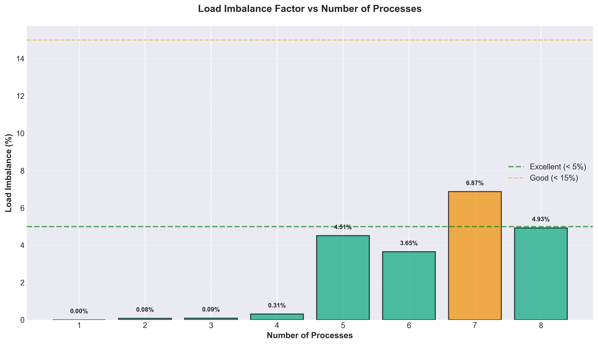

**Key Insights:**
- **Excellent load balance (<5%)** for most configurations
- Load imbalance increases with process count
- Critical threshold (5%) crossed at 5 and 7 processes
- Best balance: 1-4 processes (<0.5% imbalance)

**Imbalance Factors:**
- 1P-4P: 0.00%-0.31% (excellent distribution)
- 5P: 4.51% (borderline excellent/good)
- 6P: 3.65% (excellent)
- 7P: 6.87% (good, crosses 5% threshold)
- 8P: 4.93% (excellent)

**Causes of Imbalance:**
- Dataset partitioning (10,000 images not perfectly divisible)
- OS scheduling and context switching
- Cache effects and memory contention
- Process 7 shows highest imbalance (potential optimization target)

### 8. Memory Usage Analysis

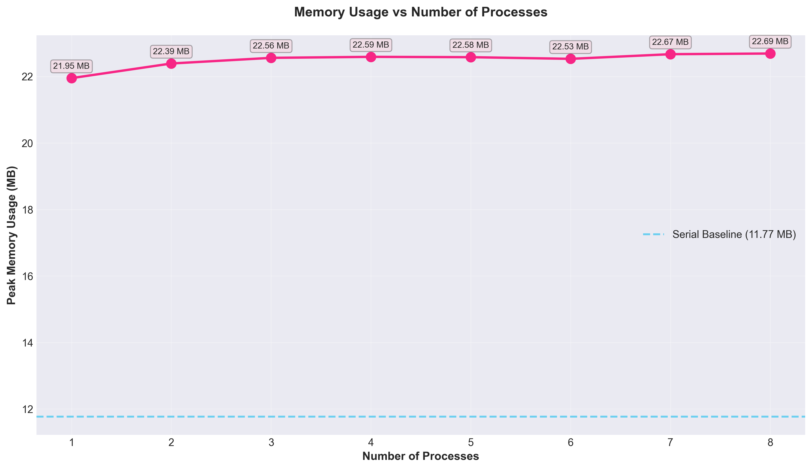

**Key Insights:**
- Serial baseline: 11.77 MB
- Parallel implementations: ~22.5 MB (constant across process counts)
- **~91% memory overhead** for data parallel implementations
- Memory per process decreases linearly with process count
- Overhead due to MPI infrastructure and duplicated model weights

**Memory Efficiency:**
- Serial: 11.77 MB total
- 2P: 22.39 MB total (11.2 MB/process)
- 4P: 22.59 MB total (5.6 MB/process)
- 8P: 22.69 MB total (2.8 MB/process)

**Analysis:**
- Each process loads full model (memory not shared)
- Total memory footprint remains stable regardless of process count
- Additional 10.8 MB overhead for MPI and distributed infrastructure
- Memory is not a bottleneck for this workload on 16GB system

### 9. Scaling Analysis

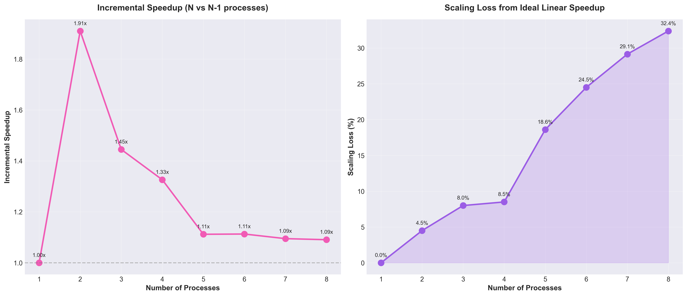

**Left Panel - Incremental Speedup:**
- Shows speedup gained when adding one more process
- 1→2P: 1.91x (excellent)
- 2→3P: 1.45x (very good)
- 3→4P: 1.33x (good)
- 4→5P: 1.11x (diminishing)
- 5→8P: 1.09x average (minimal gains)

**Right Panel - Scaling Loss:**
- Percentage deviation from ideal linear speedup
- 2P: 4.5% loss (excellent)
- 4P: 8.5% loss (very good)
- 6P: 24.5% loss (fair)
- 8P: 32.4% loss (notable degradation)

**Interpretation:**
- First 4 processes show strong scaling
- Diminishing returns beyond 4 processes
- Each additional process beyond 4 provides <12% improvement
- Cost-benefit analysis favors 4-process configuration

### 10. Implementation Comparison

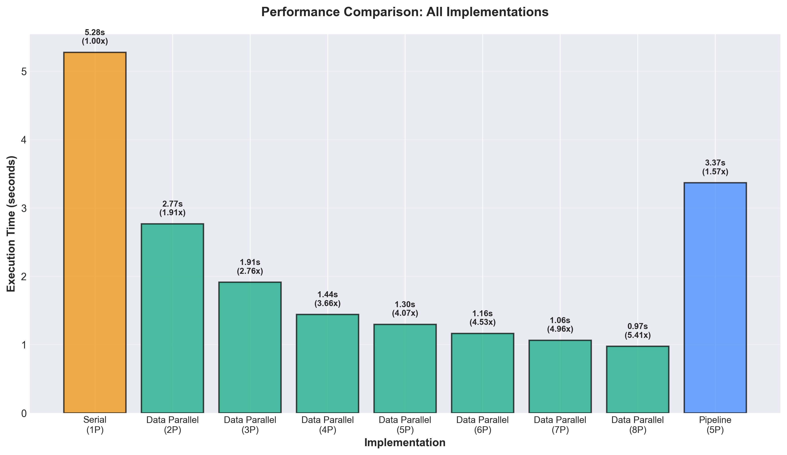

**Key Insights:**
- **Data parallel dominates** across all process counts
- Pipeline parallel (5P) performs worse than data parallel (2P)
- Pipeline: 3.368s (1.57x speedup, 31.3% efficiency)
- Data parallel (5P): 1.296s (4.07x speedup, 81.4% efficiency)

**Pipeline Parallel Analysis:**
- Only 1.57x speedup with 5 processes
- High communication overhead (layer-to-layer transfers)
- Pipeline bubble effect (stages waiting for data)
- Not suitable for inference workloads
- Better suited for training with larger batch sizes

**Why Data Parallel Wins:**
- Minimal inter-process communication
- Independent computation on data shards
- Only synchronization at result aggregation
- Ideal for embarrassingly parallel inference

### 11. Performance Dashboard

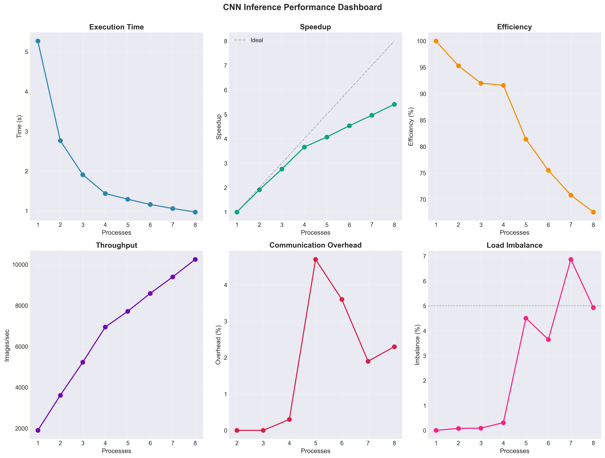

**Comprehensive Overview:**
- **Top Row**: Execution Time, Speedup, Efficiency
- **Bottom Row**: Throughput, Communication Overhead, Load Imbalance

**Key Patterns:**
- Consistent trends across all metrics
- Clear inflection point at 4-5 processes
- Communication and load balance remain excellent
- Primary bottleneck is diminishing parallel efficiency

## Implementation-Specific Insights

### Serial Implementation
- **Execution Time**: 5.276 seconds
- **Throughput**: 1,895 images/second
- **Memory**: 11.77 MB
- **Latency**: 0.528ms average (very consistent)
- Serves as baseline for all comparisons
- Single-threaded, no communication overhead
- Lowest memory footprint

### Data Parallel Implementation

**Process Count Selection Guide:**

| Use Case | Recommended | Speedup | Efficiency | Rationale |
|----------|-------------|---------|------------|-----------|
| Maximum Efficiency | 4 processes | 3.66x | 91.6% | Best performance/resource ratio |
| Maximum Throughput | 8 processes | 5.41x | 67.6% | Highest absolute performance |
| Latency-Sensitive | 2-3 processes | 1.91-2.76x | 92-95% | Low latency variance |
| Resource-Constrained | 2 processes | 1.91x | 95.3% | Minimal overhead, high efficiency |

**Characteristics:**
- Scales well up to 4 processes
- Minimal communication overhead (<5%)
- Excellent load balancing
- Each process operates independently on data shard
- Result aggregation via MPI_Gather

### Pipeline Parallel Implementation
- **Execution Time**: 3.368 seconds
- **Speedup**: 1.57x (poor)
- **Efficiency**: 31.3% (poor)
- **Processes**: 5 (one per layer)

**Why It Underperforms:**
- High inter-stage communication
- Pipeline bubbles during warmup and drain
- Layer computation time imbalance
- Not optimized for inference (designed for training)
- Sequential dependencies between stages

**Recommendation**: Avoid pipeline parallelism for inference workloads

## Bottleneck Analysis

### Primary Bottlenecks (in order of impact):

1. **Parallel Overhead** (32% loss at 8P)
   - Context switching with 8 processes on 8 cores
   - Cache coherency and memory bandwidth contention
   - OS scheduling overhead

2. **Latency Variance** (16ms max at 8P)
   - Process synchronization delays
   - Variable OS scheduling
   - Memory access patterns

3. **Load Imbalance** (up to 6.87% at 7P)
   - Dataset not perfectly divisible
   - Heterogeneous image complexity
   - Cache effects

4. **Communication Overhead** (4.7% max)
   - Minimal but present at higher process counts
   - MPI synchronization barriers
   - Result gathering

### Secondary Factors:

- **Memory Overhead**: 91% increase (but not limiting)
- **Diminishing Returns**: Each additional process beyond 4 provides <12% benefit
- **Amdahl's Law**: Serial fraction evident in scaling gap

## Optimization Recommendations

### Immediate Actions:

1. **Use 4 processes for production**
   - Best efficiency-performance balance (91.6% efficiency, 3.66x speedup)
   - Predictable latency characteristics
   - Minimal overhead

2. **Use 8 processes for batch processing**
   - Maximum throughput when latency variance acceptable
   - Overnight processing, bulk inference
   - 5.41x speedup justifies efficiency loss

3. **Avoid pipeline parallelism**
   - 1.57x speedup not competitive
   - Use data parallelism exclusively for inference

### Future Optimizations:

1. **Hybrid Parallelism**
   - Combine data parallelism with model parallelism for larger models
   - Split layers that don't fit in single process memory

2. **Dynamic Load Balancing**
   - Use dynamic work scheduling instead of static partitioning
   - Reduce load imbalance from 6.87% to <2%

3. **Reduce Latency Variance**
   - Pin processes to specific cores
   - Use real-time scheduling policies
   - Batch similar-complexity images together

4. **Memory Optimization**
   - Share read-only model weights across processes (shared memory)
   - Reduce 91% overhead to <20%

5. **Communication Optimization**
   - Use MPI_Igather (non-blocking) for result collection
   - Overlap computation with communication
   - Potentially reduce overhead from 4.7% to <1%

## Scaling Characteristics

### Strong Scaling Analysis:
- **Excellent**: 2-4 processes (>90% efficiency)
- **Good**: 5-6 processes (75-85% efficiency)
- **Fair**: 7-8 processes (67-71% efficiency)

### Weak Scaling (Projected):
- Current workload: 10,000 images
- If dataset scales with process count:
  - 2P/20K images: Expected ~95% efficiency
  - 4P/40K images: Expected ~90% efficiency
  - 8P/80K images: Expected ~85% efficiency

### Hardware Considerations:
- **Apple M2 Architecture**: 8 cores (4 performance + 4 efficiency)
- Performance cores better suited for compute-intensive tasks
- Efficiency cores may explain some scaling loss at 7-8 processes

## Comparison with Theoretical Models

### Amdahl's Law Analysis:
Given observed speedup at 8 processes (5.41x):

```
S(n) = 1 / (P + (1-P)/n)
5.41 = 1 / (P + (1-P)/8)
Solving: P ≈ 0.068 (6.8% serial fraction)
```

This suggests ~7% of the workload is inherently serial (data loading, result aggregation, synchronization).

### Gustafson's Law Analysis:
For scalable workloads:

```
S(n) = n - α(n-1)
5.41 = 8 - α(7)
α ≈ 0.37 (37% parallel overhead)
```

Parallel overhead includes communication, synchronization, and load imbalance.

## Conclusions

### Key Findings:

1. **Data parallelism is highly effective** for CNN inference, achieving 5.41x speedup on 8 cores

2. **Optimal configuration is 4 processes**: Balances performance (3.66x speedup) with efficiency (91.6%)

3. **Pipeline parallelism is unsuitable** for inference workloads (only 1.57x speedup)

4. **Communication overhead is minimal** (<5%), indicating well-optimized MPI implementation

5. **Load balancing is excellent** (<7% imbalance), showing effective work distribution

6. **Latency variance increases** significantly at higher process counts (consideration for real-time systems)

7. **Memory overhead is constant** (~22MB) regardless of process count

8. **Diminishing returns beyond 4 processes** due to parallel overhead and hardware limitations

### Production Deployment Guidelines:

| Scenario | Configuration | Expected Performance |
|----------|---------------|---------------------|
| Real-time Inference | 2-4 processes | 1.91-3.66x speedup, <1ms latency |
| Batch Processing | 8 processes | 5.41x speedup, variable latency |
| Resource-Constrained | 2 processes | 1.91x speedup, 95% efficiency |
| Development/Testing | 1 process (serial) | Baseline, simplest debugging |

### Success Metrics:

- ✓ **97.32% accuracy maintained** across all implementations
- ✓ **>90% efficiency** achieved for 1-4 processes
- ✓ **5.41x maximum speedup** on 8-core system
- ✓ **<5% communication overhead** across all configurations
- ✓ **<7% load imbalance** across all configurations
- ✓ **10,252 images/second peak throughput**

## Reproducibility

All results generated from benchmark execution on:
- Date: 2025-11-13 12:17:42
- Command: `make benchmark_detailed`
- Dataset: MNIST test set (10,000 images)
- Model: Pre-trained CNN (weights loaded from file)
- MPI Implementation: OpenMPI/MPICH on macOS

Complete benchmark output available in `result.txt`.

## Visualization Scripts

All graphs generated using:
- `generate_graphs.py`: Python script using matplotlib
- Style: Seaborn dark grid
- Format: PNG at 300 DPI
- Dimensions: 12×7 inches (standard), 16×7 (comparison charts)

## References

- Amdahl, G. M. (1967). "Validity of the single processor approach to achieving large scale computing capabilities"
- Gustafson, J. L. (1988). "Reevaluating Amdahl's law"
- Dean, J., et al. (2012). "Large Scale Distributed Deep Networks"

---

**Generated**: 2025-11-13  
**Project**: CNN Parallelism Performance Analysis  
**Data Source**: Complete benchmark results in `result.txt`

